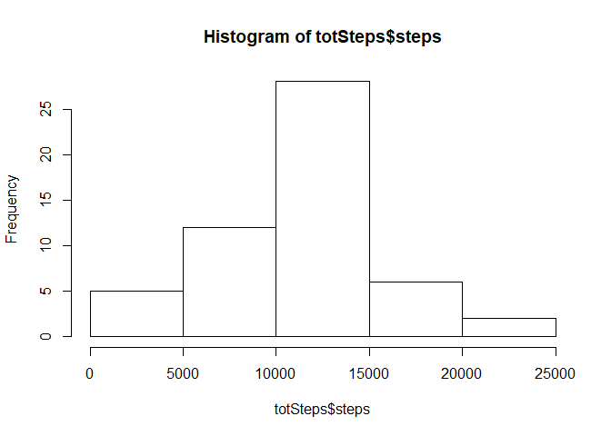
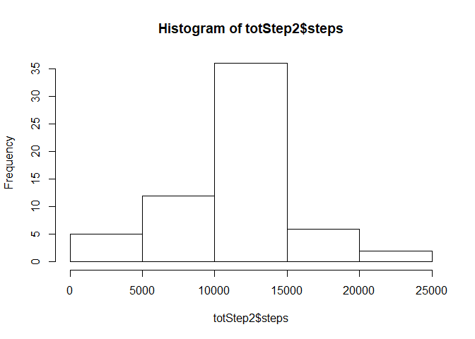

# Reproducible Research: Peer Assessment 1


## Loading and preprocessing the data
1. Loading & Processing Data

```r
    actData<-read.csv("activity.csv")
```

## What is mean total number of steps taken per day?
1. Total number of steps taken per day:


```r
totSteps<-aggregate(steps~date,data=actData,sum,na.rm=TRUE)
```

2. Histohgram of total steps taken er day.

```r
hist(totSteps$steps)
```

<!-- -->

3. Total number of steps mean and median 
* Mean of total number of steps taken per day is:

```r
mean(totSteps$steps)
```

```
## [1] 10766.19
```
*Median for total number of steps taken per day is:

```r
median(totSteps$steps)
```

```
## [1] 10765
```


## What is the average daily activity pattern?

1. Make a time series plot (i.e. type = "l") of the 5-minute interval (x-axis) and the average number of steps taken, averaged across all days (y-axis)


```r
stepsInterval<-aggregate(steps~interval,data=actData,mean,na.rm=TRUE)
plot(steps~interval,data=stepsInterval,type="l")
```

<!-- -->
2. Which 5-minute interval, on average across all the days in the dataset, contains the maximum number of steps?


```r
stepsInterval[which.max(stepsInterval$steps),]$interval
```

```
## [1] 835
```

## Imputing missing values

1. Calculate and report the total number of missing values in the dataset (i.e. the total number of rows with NAs)

```[r]
sum(is.na(actData$steps))
```

2. Devise a strategy for filling in all of the missing values in the dataset. The strategy does not need to be sophisticated. For example, you could use the mean/median for that day, or the mean for that 5-minute interval, etc.

*Strategy is to fill the missing values with the mean of the missing five minutes interval through the following function.


```r
interval2steps<-function(interval){
stepsInterval[stepsInterval$interval==interval,]$steps
}
```
3. Create a new dataset that is equal to the original dataset but with the missing data filled in.
*following is the full dataset with missing values filled in:


```r
actFull<-actData

 count=0
 for(i in 1:nrow(actFull)){
     if(is.na(actFull[i,]$steps)){
         actFull[i,]$steps<-interval2steps(actFull[i,]$interval)
         count=count+1
     }
 }
cat("Total", i, "NA values were filled.\n\r")
```

```
## Total 17568 NA values were filled.
## 
```

4. Make a histogram of the total number of steps taken each day and Calculate and report the mean and median total number of steps taken per day. 


```r
totStep2<-aggregate(steps~date,data=actFull,sum)
hist(totStep2$steps)
```

<!-- -->

```r
mean(totStep2$steps)
```

```
## [1] 10766.19
```

```r
median(totStep2$steps)
```

```
## [1] 10766.19
```
* The **mean** total number of steps taken per day is 1.0766189\times 10^{4} steps.
* The **median** total number of steps taken per day is 1.0766189\times 10^{4} steps.
 
 * Do these values differ from the estimates from the first part of the assignment? What is the impact of imputing missing data on the estimates of the total daily number of steps?
 
 The mean values will still be the same because we filled the missing intervals with the 5 minutes mean of the interval; however, the median value would skew depending on where the filled missing values are in addition to the missing values being filled with means of the five minutes interval.
 
 
## Are there differences in activity patterns between weekdays and weekends?

1. Create a new factor variable in the dataset with two levels - "weekday" and "weekend" indicating whether a given date is a weekday or weekend day.


```r
actFull$day=ifelse(as.POSIXlt(as.Date(actFull$date))$wday%%6==0,"weekend","weekday")
actFull$day=factor(actFull$day,levels=c("weekday","weekend"))
```

2. Make a panel plot containing a time series plot (i.e. type = "l") of the 5-minute interval (x-axis) and the average number of steps taken, averaged across all weekday days or weekend days (y-axis). See the README file in the GitHub repository to see an example of what this plot should look like using simulated data.


```r
 stpint2=aggregate(steps~interval+day,actFull,mean)

 library(lattice)

 xyplot(steps~interval|factor(day),data=stpint2,aspect=1/2,type="l")
```

<!-- -->
